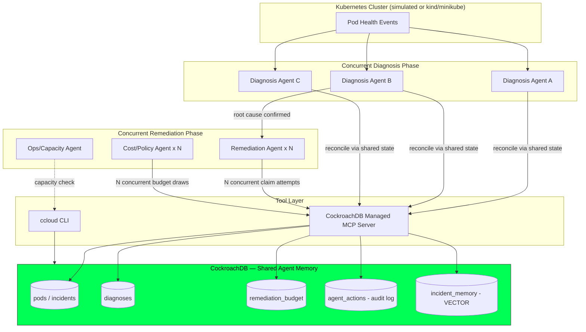

# AgentGuard
### Concurrency-Safe, Shared-Memory Incident Response for Kubernetes
*CockroachDB × AWS Hackathon — Build with Agentic Memory*

> **Tagline:** Siloed agents guess in parallel. AgentGuard's agents remember together.

---

## 1. Problem Statement

Kubernetes environments are increasingly monitored by AI agents rather than humans watching dashboards. The naive way to scale this is to spin up more agents — one watching this deployment, another watching that node, several reasoning about the same failing pod at once. That naive approach has a specific, avoidable failure mode:

**Agents that don't share memory don't know what the others have already found, decided, or done.** Three diagnosis agents can independently investigate the same crashing pod and produce three different, contradictory root causes. Two remediation agents can each independently decide to restart the same deployment, unaware the other already did. A cost-approval agent can approve a rollback five seconds after another agent already spent the same budget on a scale-up. None of these agents are wrong on their own — they're wrong *together*, because nothing is arbitrating shared state between them.

**AgentGuard solves this directly: agents that monitor and remediate Kubernetes pods concurrently, sharing one transactional, always-consistent memory — instead of siloed agents that duplicate work, contradict each other, or act on stale conclusions.**

The system has two concurrent phases, both built on the same shared memory layer:

1. **Concurrent Diagnosis** — multiple diagnosis agents investigate the same pod incident at once (checking logs, metrics, recent deploys, past incidents). Because they share memory, the second and third agent can see what the first has already found, avoid duplicating the investigation, and the system reconciles disagreement instead of silently keeping three unrelated "root causes."
2. **Concurrent Remediation** — once a root cause is confirmed, multiple remediation-capable agents may still race to act on it (this happens for real when several independent triggers — an alert, a human, a scheduled health check — fire near-simultaneously). Only one action is allowed to commit; the shared memory layer is what prevents a duplicate restart or a rollback racing a scale-up.

**The central technical claim we prove, not just assert:**

> CockroachDB's serializable, distributed transactions let a fleet of agents share one consistent memory of "what's known" and "what's been done" — so concurrent agents reconcile instead of collide, and no invalid concurrent outcome is ever silently committed.

**Why this is win-worthy, honestly:** most competing submissions will build a single agent with a vector-search memory and call it "agentic memory." AgentGuard is the submission where *removing* CockroachDB's concurrency guarantees would visibly break the application — duplicate diagnoses would appear, duplicate restarts would fire. That's the difference between using CockroachDB and needing it.

---

## 2. Why CockroachDB (mapped to this exact scenario)

| CockroachDB capability | Where it's load-bearing in AgentGuard |
|---|---|
| Serializable distributed transactions | Prevents two diagnosis agents from both writing "confirmed root cause" for the same incident; prevents two remediation agents from both claiming the same fix |
| Distributed vector indexing | Diagnosis agents recall similar past pod failures and their resolutions, in the same store as live incident state — no separate vector DB, no sync gap |
| Horizontal scale | Kubernetes clusters can have hundreds of pods failing across a fleet of monitoring agents simultaneously; the memory layer can't be the bottleneck |
| Multi-node resilience | An agent's shared memory going down mid-incident is worse than no memory — the cluster keeps serving through node loss |
| Managed MCP Server | Every agent's audited, structured path to memory — not a raw DB connection |
| ccloud CLI | Gives the Ops agent real, agent-friendly control-plane access for capacity checks before approving a remediation |

---

## 3. Architecture



---

## 4. Data Model

```sql
CREATE TABLE incidents (
    incident_id     UUID PRIMARY KEY DEFAULT gen_random_uuid(),
    pod_name        STRING NOT NULL,
    namespace       STRING NOT NULL,
    status          STRING NOT NULL,   -- DETECTED, DIAGNOSING, DIAGNOSED, REMEDIATING, RESOLVED
    version         INT NOT NULL DEFAULT 1,
    created_at      TIMESTAMPTZ DEFAULT now()
);

-- Shared diagnosis memory: multiple agents write here, must reconcile
CREATE TABLE diagnoses (
    diagnosis_id    UUID PRIMARY KEY DEFAULT gen_random_uuid(),
    incident_id     UUID REFERENCES incidents(incident_id),
    agent_id        STRING NOT NULL,
    root_cause      STRING NOT NULL,
    confidence      DECIMAL,
    status          STRING NOT NULL,   -- PROPOSED, CONFIRMED, SUPERSEDED
    created_at      TIMESTAMPTZ DEFAULT now()
);

CREATE TABLE remediation_budget (
    namespace   STRING PRIMARY KEY,
    budget      DECIMAL NOT NULL
);

CREATE TABLE agent_actions (
    action_id     UUID PRIMARY KEY DEFAULT gen_random_uuid(),
    incident_id   UUID REFERENCES incidents(incident_id),
    agent_id      STRING NOT NULL,
    action        STRING NOT NULL,
    outcome       STRING NOT NULL,   -- COMMITTED, REJECTED, RETRIED, SUPERSEDED
    created_at    TIMESTAMPTZ DEFAULT now()
);

CREATE TABLE incident_memory (
    memory_id     UUID PRIMARY KEY DEFAULT gen_random_uuid(),
    incident_id   UUID,
    summary       STRING,
    resolution    STRING,
    embedding     VECTOR(3072),   -- gemini-embedding-001 outputs 3072 dims
    created_at    TIMESTAMPTZ DEFAULT now()
);

CREATE VECTOR INDEX (embedding) ON incident_memory (embedding);
```

**Two distinct concurrency mechanics, both real:**
- **Diagnosis reconciliation:** when a second agent proposes a `diagnosis`, a transaction checks whether an existing `CONFIRMED` diagnosis already exists for the incident; if so, the new one is written as `SUPERSEDED` rather than treated as an independent truth — this is shared-memory reconciliation, not just a race.
- **Remediation claim + budget:** the atomic claim pattern and the true serializable write-skew pattern from the concurrency benchmark (read budget → decide → write, causing real `SQLSTATE 40001` retries under concurrent load).

---

## 5. Sequential Build Plan — Joshna → Suba → Ashley

This is a relay, not three parallel silos: each phase produces a working package the next person builds directly on top of. Effort is equal — each phase owns one full concurrency mechanic end-to-end, not just plumbing.

### 🟦 Phase 1 — Joshna: Shared Memory Foundation
*Everyone else's agents are useless without this. Build it first, build it solid.*

- [ ] Provision CockroachDB Cloud cluster; TS schema migrations for all 5 tables
- [ ] Build `@agentguard/db`: typed client, connection pooling, retry wrapper for `SQLSTATE 40001`
- [ ] Wire the **CockroachDB Managed MCP Server** as the agents' audited memory-access path
- [ ] Build the **embedding pipeline** + seed `incident_memory` with sample past pod incidents (this is the **Distributed Vector Indexing** requirement — covered here so Suba's diagnosis agents have something to recall from day one)
- [ ] Build a **pod-event simulator** (TS script/API) that generates realistic Kubernetes pod failure events into `incidents` — CrashLoopBackOff, OOMKilled, image pull errors, etc. (use `kind`/simulated events rather than a live cluster unless time allows)
- [ ] Publish `@agentguard/db` + a running, seeded cluster + a documented MCP connection as the handoff to Phase 2

**Handoff deliverable:** a live CockroachDB cluster, seeded with memory, reachable via MCP, with pod incidents flowing in — ready for agents to consume.

### 🟩 Phase 2 — Suba: Concurrent Diagnosis (the shared-memory thesis, proven)
*This is where the core argument of the whole project gets demonstrated.*

- [ ] Build the **LangGraph diagnosis subgraph**: N Diagnosis Agents run concurrently against the same incident
- [ ] Implement `search_similar_incidents` as a LangChain tool (vector query against Joshna's `incident_memory`)
- [ ] Implement the **reconciliation transaction**: when an agent proposes a diagnosis, check for an existing `CONFIRMED` diagnosis for that incident inside the same transaction; if present, mark the new one `SUPERSEDED` instead of writing a contradicting truth
- [ ] Build the **diagnosis benchmark**: fire 5–10 concurrent diagnosis agents at one incident, show how many proposed vs. confirmed vs. superseded — this is the "siloed vs. shared memory" proof point, run once *with* reconciliation and once with it disabled to show the contrast
- [ ] Build the **Cost/Policy agent's approval logic** (reads `remediation_budget`, decides if a proposed fix is affordable) — sets up Phase 3's remediation race
- [ ] Publish `@agentguard/agents` (diagnosis + policy nodes) as the handoff to Phase 3

**Handoff deliverable:** a working concurrent diagnosis pipeline that provably reconciles conflicting agent conclusions into one confirmed root cause, ready to trigger remediation.

### 🟨 Phase 3 — Ashley: Concurrent Remediation, Proof & Delivery
*Takes a confirmed diagnosis and closes the loop — action, verification, and the numbers that prove it all worked.*

- [ ] Implement the **atomic claim transaction** for remediation (`UPDATE incidents SET status='REMEDIATING' WHERE status='DIAGNOSED'`)
- [ ] Implement the **budget write-skew transaction** on `remediation_budget` — real concurrent read-then-write causing genuine `40001` conflicts, caught and retried
- [ ] Build the **ccloud CLI tool** for the Ops/Capacity agent (capacity check before approving a remediation)
- [ ] Build the **full-fleet benchmark harness**: fires 10/50/100 concurrent remediation + cost agents at once, logs real committed/rejected/retried counts
- [ ] Build the **Consistency Checker service**: independently audits `agent_actions` + final table state after a run — no duplicate commits, no negative budget, no incident left inconsistent
- [ ] Build the minimal **live console/dashboard** surfacing diagnosis reconciliation numbers (Phase 2) and remediation race numbers (Phase 3) together in one view
- [ ] Final end-to-end integration test: pod event → concurrent diagnosis → reconciliation → concurrent remediation race → consistency check, all real, all measured

**Handoff deliverable:** the complete, working, end-to-end AgentGuard application with real, reproducible concurrency numbers.

---

## 6. Hackathon Requirement Mapping

**CockroachDB tools (2 required, 3 used):**
- Distributed Vector Indexing — `incident_memory`, built in Phase 1, used in Phase 2
- Managed MCP Server — every agent's memory-access path, wired in Phase 1
- ccloud CLI — Ops/Capacity agent, built in Phase 3

**AWS services:**
- AWS Lambda — every agent (diagnosis, remediation, cost, ops) runs as an independently invokable Lambda function, which is what makes the concurrent benchmarks real rather than simulated
- Amazon Bedrock — foundation model calls for agent reasoning
- Amazon S3 — dashboard hosting

---

## 7. What Makes This Win-Worthy (and the honest risk to manage)

**Strength:** the project has *two* real concurrency mechanics (diagnosis reconciliation and remediation race), not one — and the diagnosis-reconciliation demo directly answers the exact "siloed agents vs. shared memory" framing the hackathon brief opens with, almost word for word.

**Risk to manage:** don't let the pitch imply this is purely theoretical. Ground it with one sentence in the demo: *"agents can fire near-simultaneously today from independent triggers — a scheduled health check, an alert webhook, and a human — this isn't a manufactured scenario, it's what happens the moment you have more than one automated trigger watching the same service."* Say that up front rather than waiting for a judge to ask.
